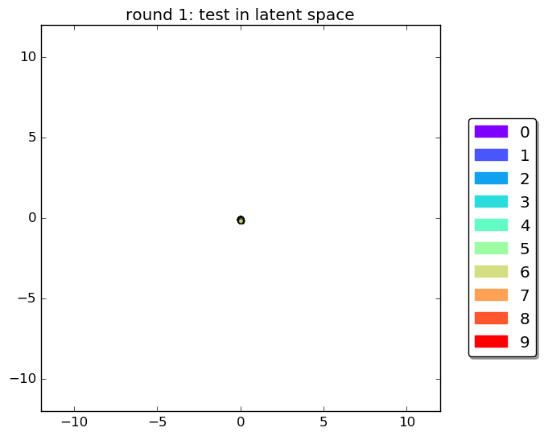
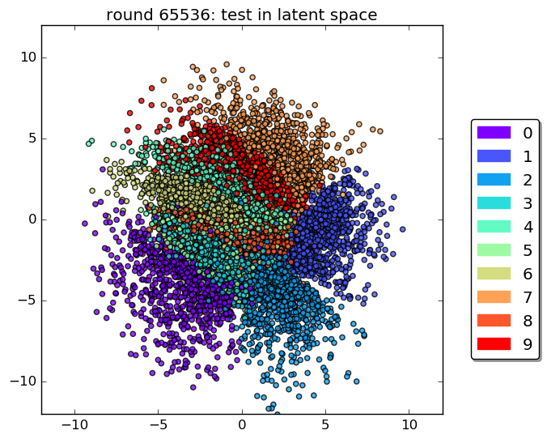
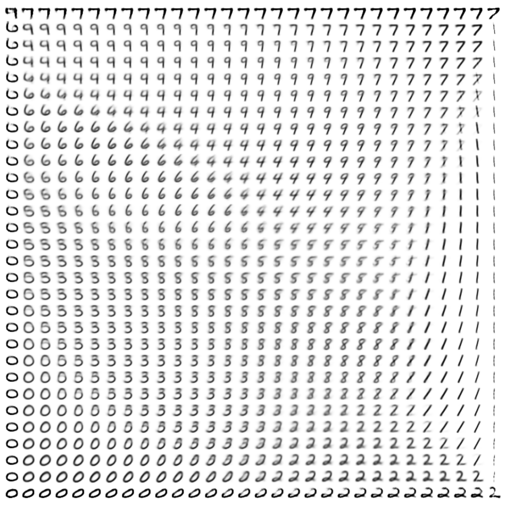

# Adversarial Autoencoder in Tensorflow

Tensorflow implementation of [Adversarial Autoencoders](https://arxiv.org/abs/1511.05644). Based on code from a really cool [blog post](http://blog.fastforwardlabs.com/post/149329060653/under-the-hood-of-the-variational-autoencoder-in) as well as parts of [InfoGAN](https://github.com/openai/InfoGAN/)

## Prerequisites

- Python 2.7
- [Tensorflow 0.10.0rc0](https://www.tensorflow.org/)
- [SciPy](http://www.scipy.org/install.html)
- [Prettytensor 0.6.2](https://github.com/google/prettytensor)
- [Progressbar 2.3](https://pypi.python.org/pypi/progressbar/2.3)

## Usage

To train an AAE (or other models) with default parameters on the MNIST dataset:

    $ python main.py --aae
    $ python main.py --vae
    $ python main.py --vaae

The different models effectively refer to different types of regularization of the posterior distribution. While in the classical Variational Autoencoder the posterior distribution of latent variables is pushed to match the prior distribution through minimization of the KL-divergence, in the Adversarial Autoencoder the posterior distribution is encouraged to match a target prior distribution through a discriminator/generator min/max game.
Both regularizations can, however, be easily combined (=VAAE).

The above commands will download MNIST and store it in the driectory. Alternatively, you can also define a path variable to the directory with your already downloaded mnist directory:

    $ export DATASETS=~/path/to/mnist/
    $ python main.py --aae

## Results - MNIST

### Encoding

The encoding of the test set over time:

The final encoding of the test set:

### Generation of images

Exploration of the 2-dimensional latent space:

## Author

Mathias Schmerling
